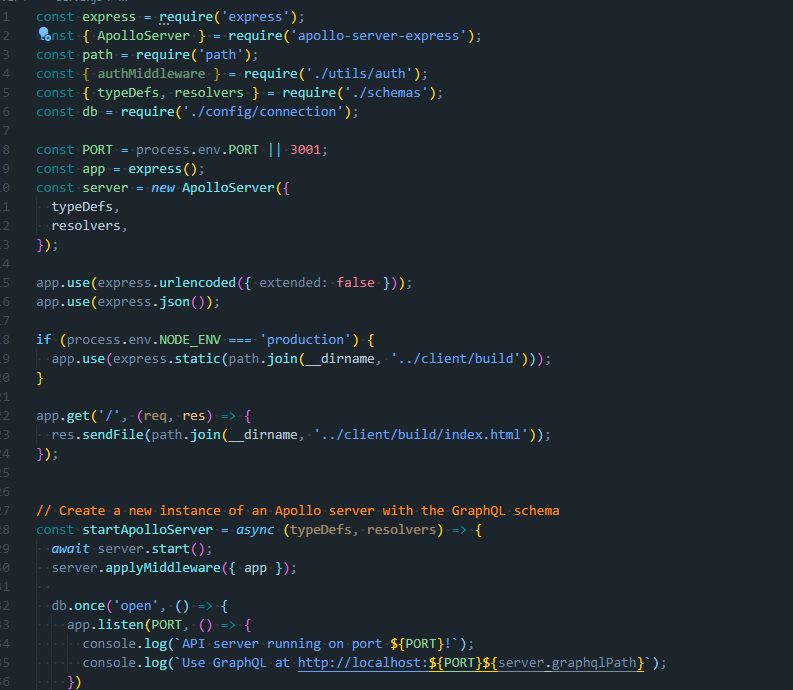
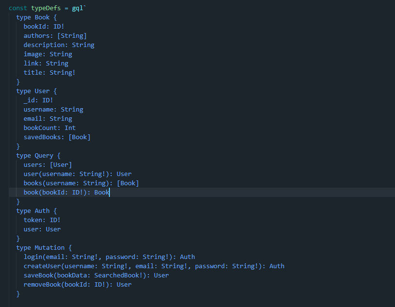

# Book Search Engine-Bryson Kern

## Description

For this project I reconfigured a working app to work with graphQL and apollo server. This app allows users to search any book of their chooseing and get detailed information back about the selected book. Users are able to create an account and save books that they are interested in. The movitation behind this assignment was to get more familiar with apollo server and GraphQL.

## Table of Contents 🧙

- [installation](#installation)
- [Usage](#usage)
- [Credits](#credits)
- [License](#license)
- [Questions](#Questions)

## Installation

In order to install this project one must first download the repo from github. After the user downloads the repo, they must then run the commands "NPM Install" and "npm run develop" to start the server and the application.

 
 

## Usage

Using the book search engine is very simple. Just type in any book title and click search and the results for your book will be populated on the page. If you want to create an accounts, its as simple as clicking the create account button.

## Credits

- https://developer.mozilla.org/en-US/
- https://www.w3schools.com/

## License

    Copyright 2022 Bryson Kern
    Permission is hereby granted, free of charge, to any person obtaining a copy of this software and associated documentation files (the "Software"), to deal in the Software without restriction, including without limitation the rights to use, copy, modify, merge, publish, distribute, sublicense, and/or sell copies of the Software, and to permit persons to whom the Software is furnished to do so, subject to the following conditions:

    The above copyright notice and this permission notice shall be included in all copies or substantial portions of the Software.

    THE SOFTWARE IS PROVIDED "AS IS", WITHOUT WARRANTY OF ANY KIND, EXPRESS OR IMPLIED, INCLUDING BUT NOT LIMITED TO THE WARRANTIES OF MERCHANTABILITY, FITNESS FOR A PARTICULAR PURPOSE AND NONINFRINGEMENT. IN NO EVENT SHALL THE AUTHORS OR COPYRIGHT HOLDERS BE LIABLE FOR ANY CLAIM, DAMAGES OR OTHER LIABILITY, WHETHER IN AN ACTION OF CONTRACT, TORT OR OTHERWISE, ARISING FROM, OUT OF OR IN CONNECTION WITH THE SOFTWARE OR THE USE OR OTHER DEALINGS IN THE SOFTWARE.

## Questions

Feel free to contact me with any questions or concerns!

- email: kernbryson@yahoo.com
- GitHub: https://github.com/kernbryson
